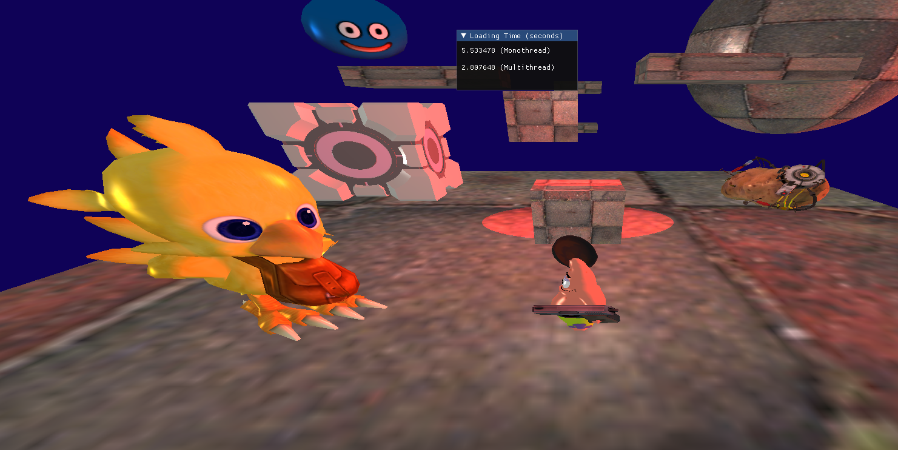

# Project Multithread Resource Manager
<hr />

**Authors : Lise Omaya, Vincent Devine**

For ISART Digital

<hr /><br />

## **Project description :**
With this projet our aim was to use multithreading to load our engine's resources (models, textures, shaders) quicker. To measure our speed gain (from mono to multi threading), we used a simple chrono. We halved the time needed to load resources. <br />
As guidelines, we had to use the engine we previously created and refrain from using mutex and the like. We were allowed to use atomic boolean to recreate our own locks.<br />

## **To build and run the project :** 
Open the project in Visual Studio and start this (F5).
<br /><hr />


## **Commands :**
- W/S : Move forward/backward
- A/D : Move left/right
- Space : Jump
- Mouse : Look in a direction 
- Right click : Lock mouse in window
- ESC : Return to menu
- F1 : Show editor/collider
<br /><hr />


<br /><hr />

## **Hardest parts**
- Find data races (and the bugs they can create)

## **Project UML**
https://lucid.app/lucidchart/e70824a9-731b-4c3f-bbdf-e0ea39f02f9d/edit?referringApp=google+drive&beaconFlowId=b5d77d29014a75ce&page=0_0# 
<hr />

## **Architecture**
```sh.
├───.vs
├───OpenGL
│   │   imgui.ini
│   │   Log.txt
│   │   OpenGL.vcxproj
│   │   OpenGL.vcxproj.filters
│   │   OpenGL.vcxproj.user
│   │
│   ├───Debug
│   │
│   ├───DLL
│   │
│   ├───Headers
│   │   │   App.hpp
│   │   │   Assertion.hpp
│   │   │   Camera.hpp
│   │   │   Collider.hpp
│   │   │   Collision.hpp
│   │   │   Credit.hpp
│   │   │   GameObject.hpp
│   │   │   Graph.hpp
│   │   │   IComponent.hpp
│   │   │   InputsManager.hpp
│   │   │   IResource.hpp
│   │   │   Light.hpp
│   │   │   LightManager.hpp
│   │   │   Log.hpp
│   │   │   Menu.hpp
│   │   │   Mesh.hpp
│   │   │   Model.hpp
│   │   │   MyMaths.hpp
│   │   │   OBJParser.hpp
│   │   │   PhysicManager.hpp
│   │   │   PhysicsManager.inl
│   │   │   PlayerControler.hpp
│   │   │   Renderer.hpp
│   │   │   ResourcesManager.hpp
│   │   │   Rigidbody.hpp
│   │   │   Scene.hpp
│   │   │   Setting.hpp
│   │   │   Shader.hpp
│   │   │   TestMyMaths.hpp
│   │   │   Texture.hpp
│   │   │   ThreadsManager.hpp
│   │   │   Timer.hpp
│   │   │   Transform.hpp
│   │   │
│   │   └───ImGUI 
│   ├───Includes
│   │   ├───glad
│   │   │     
│   │   ├───GLFW
│   │   │
│   │   └───glm
│   │      
│   ├───Resources
│   │   ├───Obj
│   │   │       chocobo.obj
│   │   │       companion.obj
│   │   │       cube.obj
│   │   │       c_pistol.obj
│   │   │       frying_pan.obj
│   │   │       luma.obj
│   │   │       patrick.obj
│   │   │       potatOS.obj
│   │   │       quad.obj
│   │   │       skipper.obj
│   │   │       Slime.obj
│   │   │       Sphere.obj
│   │   │
│   │   ├───Shaders
│   │   │       ColliderFrag.frag
│   │   │       FragmentShaderSource.frag
│   │   │       VertexShaderSource.vert
│   │   │
│   │   └───Textures
│   │           chocobo.png
│   │           companion.png
│   │           c_pistol.png
│   │           frying_pan.png
│   │           luma.png
│   │           Patrick.png
│   │           potatOS.png
│   │           sample.png
│   │           sample2.png
│   │           skipper.png
│   │           Slime.png
│   │           wall.jpg
│   │
│   ├───Screenshots
│   │       Duel.PNG
│   │       PlatformerGL.PNG
│   │       Setting.PNG
│   │
│   ├───Sources
│   │   │   App.cpp
│   │   │   Camera.cpp
│   │   │   Collider.cpp
│   │   │   Collision.cpp
│   │   │   Credit.cpp
│   │   │   GameObject.cpp
│   │   │   glad.c
│   │   │   Graph.cpp
│   │   │   InputsManager.cpp
│   │   │   InterfaceEditor.cpp
│   │   │   InterfaceEditor.hpp
│   │   │   Light.cpp
│   │   │   LightManager.cpp
│   │   │   Log.cpp
│   │   │   main.cpp
│   │   │   Menu.cpp
│   │   │   Mesh.cpp
│   │   │   Model.cpp
│   │   │   MyMaths.cpp
│   │   │   PhysicsManager.cpp
│   │   │   PlayerControler.cpp
│   │   │   Renderer.cpp
│   │   │   ResourcesManager.cpp
│   │   │   Rigidbody.cpp
│   │   │   Scene.cpp
│   │   │   Setting.cpp
│   │   │   Shader.cpp
│   │   │   TestMyMaths.cpp
│   │   │   Texture.cpp
│   │   │   ThreadsManager.cpp
│   │   │   Timer.cpp
│   │   │   Transform.cpp

<br /><hr />
Code editor : Visual Studio Community <br />
System : Windows